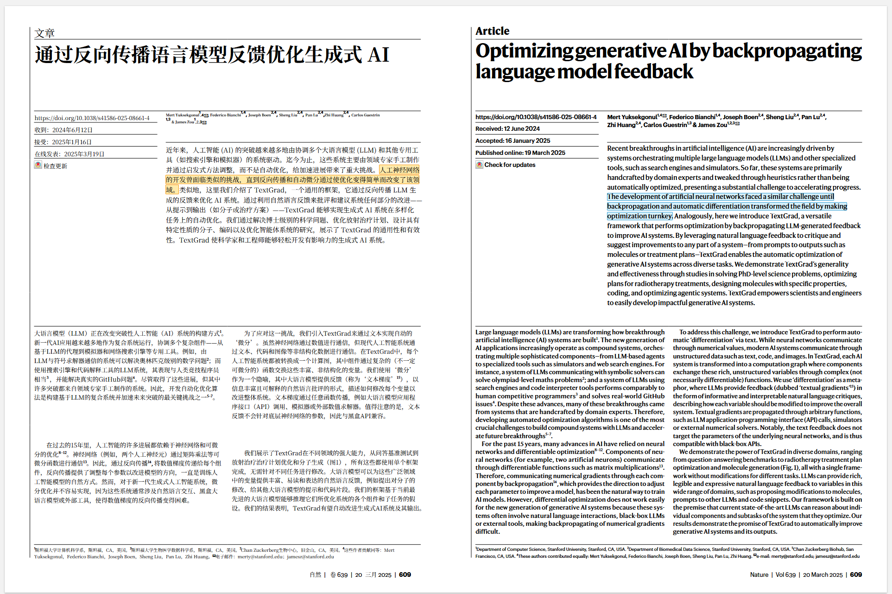
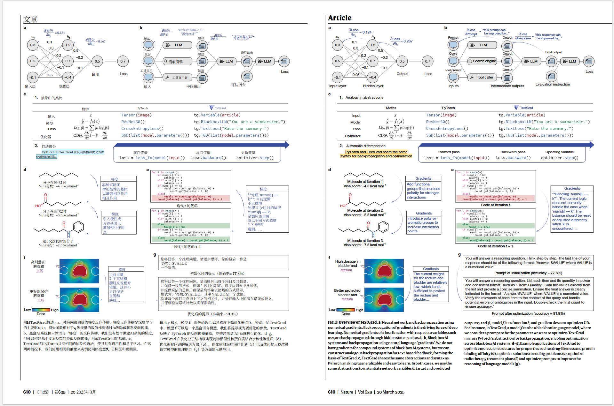
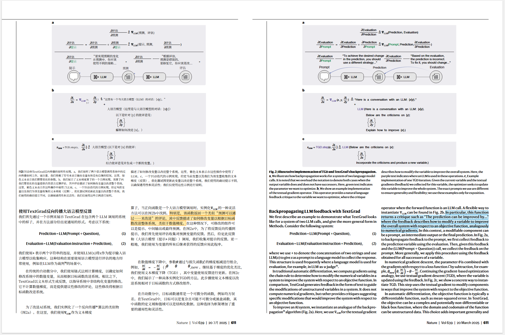
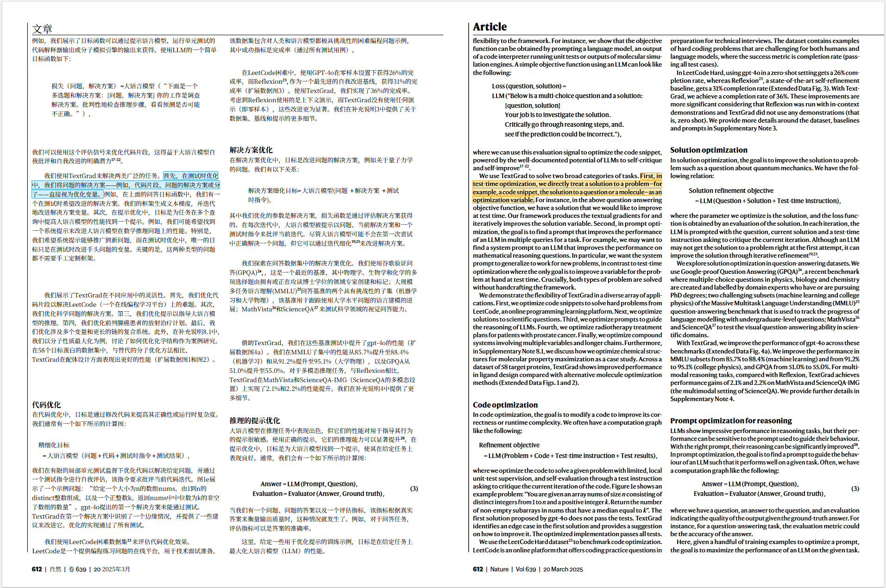

# Zotero 中英双栏阅读器

<p align="center"><strong>在 Zotero 中一键生成保留原排版的中英双栏 PDF；单击任一句，对应译句同步高亮。</strong></p>

<p align="center">
  <a href="README.md">简体中文</a> · <a href="README_EN.md">English</a>
</p>

<p align="center">
  
</p>

<p align="center"></p>
<p align="center"></p>
<p align="center"></p>

<p align="center"><sub>以上均为真实论文翻译页面，仅用于展示排版效果；论文内容与版权归各自作者所有。</sub></p>

<p align="center">
  
  
  <a href="https://github.com/Houxin2024/zotero-bilingual/releases/latest"></a>
  
</p>

<p align="center">
  <a href="https://github.com/Houxin2024/zotero-bilingual/releases/download/v0.9.4/bilingual-linked-reader-0.9.4-windows.zip"><strong>⬇️ 下载 Windows 一键安装包 v0.9.4</strong></a>
  · <a href="docs/windows-one-click.md">高级安装说明</a>
  · <a href="https://github.com/Houxin2024/zotero-bilingual/issues">问题反馈</a>
</p>

## 四步开始使用

1. [下载 Windows 安装包](https://github.com/Houxin2024/zotero-bilingual/releases/download/v0.9.4/bilingual-linked-reader-0.9.4-windows.zip)，右键选择“全部解压”。
2. 双击 `Install-Windows.cmd`，等待绿色的安装完成提示。
3. 在 Zotero 中打开 `工具 → 插件 → 右上角齿轮 → Install Add-on From File...`，从自动打开的 `addons` 文件夹分别安装两个 XPI，然后重启 Zotero。
4. 选中论文 PDF，右键选择 `PDF2zh → 翻译`。

从旧版升级时也请重新安装两个 XPI；其中 PDF2zh `4.0.3.3` 本地修订版包含新的翻译状态卡和进度修复。

> [!TIP]
> 新安装默认使用 **SiliconFlow Free**，无需注册或填写 API Key。它是联网的第三方免费服务，可能限速；敏感论文建议切换到自己的 API 或本地服务。

首次安装会下载私有 Python 运行环境、PDF2zh Next 和本地句子映射模型，通常需要数分钟。安装完成后，日常不需要再次运行 Python、移动 PDF 或手动启动服务。

安装完成后，在 Zotero 中选中原论文或其 PDF，右键选择 `PDF2zh → 翻译`。双栏 PDF 会自动附加并打开，右下角显示句子映射进度；提示“句子映射已就绪”后，单击任一句即可联动阅读。

翻译阶段会在 Zotero 窗口内显示一张可关闭的状态卡，只显示真实处理阶段，不再把子阶段误报成整篇 100%。单击 `×` 只会隐藏卡片，不会中断后台翻译；切换到其他应用时它也不会置顶遮挡。

## 隐私说明

PDF 解析、版面坐标提取、图注修复和句子映射都在本机完成。Windows 后台只监听 `127.0.0.1`，本项目作者的服务器不会接收你的论文、译文或 API Key。

翻译文本会发送给你选择的翻译服务。默认的 SiliconFlow Free 是第三方联网服务；对于未发表、保密或敏感论文，请改用你信任的 API 或本地翻译服务。

## 常见问题

<details>
<summary><strong>不配置翻译服务和 API Key，能直接用吗？</strong></summary>

可以。新安装默认选择 PDF2zh Next 的 `SiliconFlow Free`，英文翻译为简体中文，不需要 API Key。如果免费服务暂时限速或不可用，可在 PDF2zh 设置中切换 Bing、Google、OpenAI、Gemini、Ollama 等服务。

</details>

<details>
<summary><strong>为什么需要安装两个 XPI？</strong></summary>

`Zotero PDF2zh` 负责全文翻译、生成双栏 PDF 并附加回 Zotero；`Zotero Bilingual PDF Reader` 负责句子映射、进度提示和双向联动高亮。Zotero 出于安全考虑，需要用户分别确认安装扩展。

</details>

<details>
<summary><strong>翻译完成后为什么暂时还不能联动？</strong></summary>

PDF 会先返回 Zotero，随后本地后台生成句子映射。右下角会依次显示版面解析、语义编码和句子映射进度；首次运行可能稍慢，完成后会自动启用，无需重装或重新打开。

</details>

<details>
<summary><strong>每次打开 Zotero 都要手动启动后台吗？</strong></summary>

不需要。Windows 一键版默认随 Windows 登录自动启动。若你手动停止过后台，可双击桌面的“Zotero 双语阅读器 - 启动”。

</details>

<details>
<summary><strong>支持 macOS 或 Linux 吗？</strong></summary>

当前一键安装包面向 Windows 10/11 x64。macOS 和 Linux 用户可以自行部署 PDF2zh Server 与本仓库的 watcher；欢迎参与跨平台打包。

</details>

<details>
<summary><strong>出现 NetworkError 或 8890 端口冲突怎么办？</strong></summary>

先运行桌面的启动和状态快捷方式。完整排查步骤及自定义端口方法见 [Windows 安装与故障排查](docs/windows-one-click.md)。

</details>

## 开发者与高级用法

普通 Windows 用户不需要执行下面的命令。

- [Windows 安装器、参数与故障排查](docs/windows-one-click.md)
- [PDF2zh Server 与句子映射 watcher 集成](docs/pdf2zh-integration.md)
- [仅下载 Zotero Bilingual PDF Reader v0.9.4 XPI](https://github.com/Houxin2024/zotero-bilingual/releases/download/v0.9.4/bilingual-linked-reader-0.9.4.xpi)

```bash
# 构建 XPI
python scripts/build_xpi.py

# 构建完整 Windows 包
python scripts/build_windows_bundle.py
```

## 上游项目与许可证

全文翻译与排版保留由 [Zotero PDF2zh](https://github.com/guaguastandup/zotero-pdf2zh)、[PDFMathTranslate-next](https://github.com/PDFMathTranslate-next/PDFMathTranslate-next) 和 [BabelDOC](https://github.com/funstory-ai/BabelDOC) 提供。本项目在其输出之上增加 Windows 一键后台、自动句子映射、联动高亮与图注重叠修复。

仓库自身代码使用 MIT License。Windows 包内置或安装的上游组件保持各自的 AGPL、Apache-2.0 或商业双重授权条款，详见 [`windows/THIRD_PARTY_NOTICES.md`](windows/THIRD_PARTY_NOTICES.md)。

---

如果它改善了你的论文阅读体验，欢迎点一个 **Star**，也欢迎把它分享给需要双语精读的 Zotero 用户。
