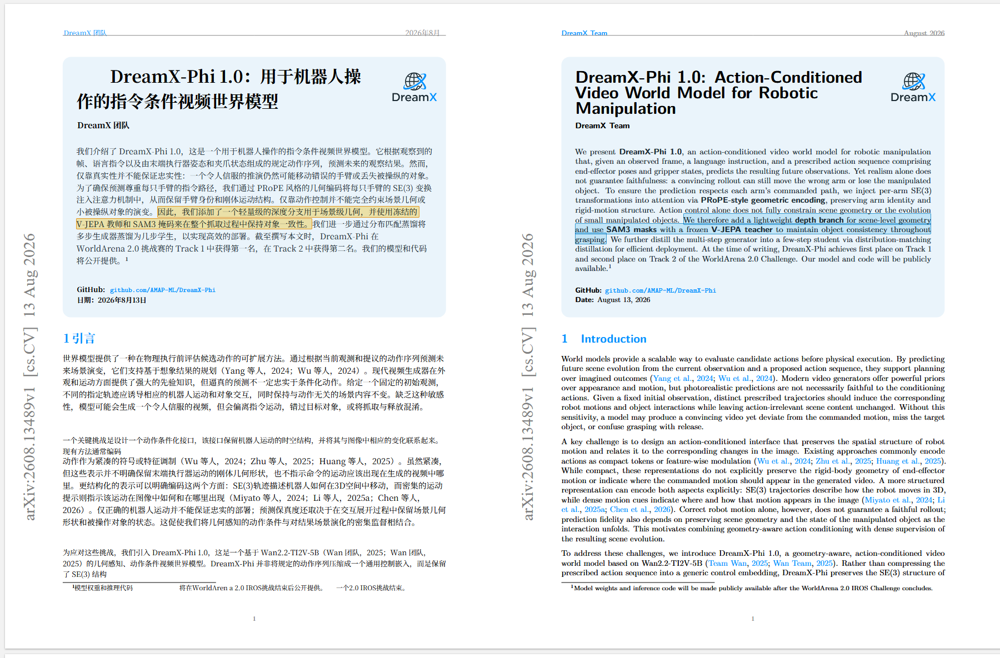
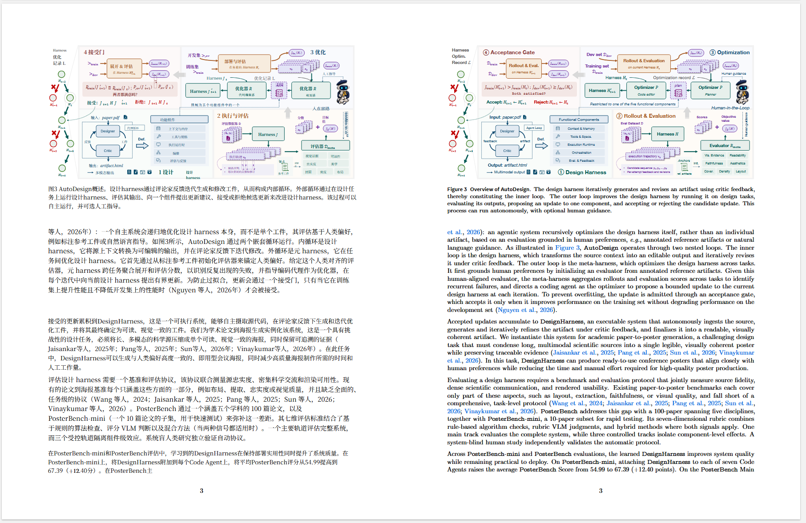
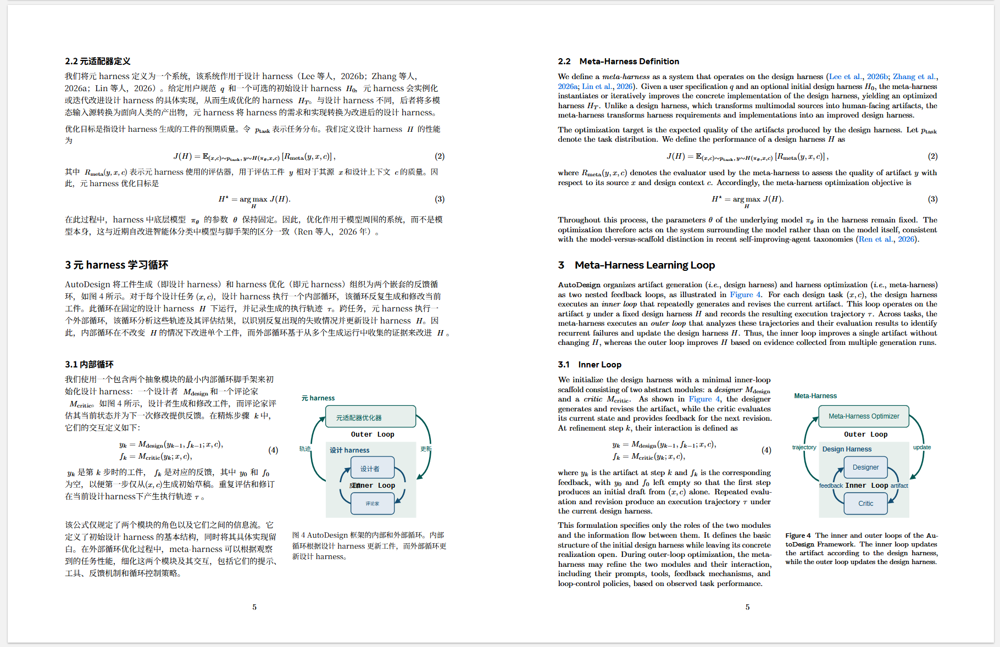

# Zotero Bilingual Linked Reader

在 Zotero 的左右双栏中英 PDF 中，单击任一句，立即高亮另一栏对应译句。双击和拖选仍保留 Zotero 原生复制、批注行为。


## 效果展示

双栏输出保留原论文的页面结构、公式、图表和标题层级；中文与英文仍处于相同的页面位置，便于逐页对照。

<p align="center">
  
</p>

<p align="center">
  
</p>

<p align="center">
  
</p>

<p align="center"><sub>真实论文页面仅用于展示排版效果；论文内容与版权归各自作者所有。</sub></p>

## Windows 一键安装（推荐）

[下载 Windows 一键安装包 v0.9.0](https://github.com/Houxin2024/zotero-bilingual-linked-reader/raw/refs/heads/main/dist/bilingual-linked-reader-0.9.0-windows.zip)

1. 下载 `bilingual-linked-reader-0.9.0-windows.zip` 并完整解压。
2. 双击 `Install-Windows.cmd`；不需要管理员权限、WSL 或预先安装 Python。
3. 安装程序会打开一个文件夹。在 Zotero 里分别安装其中的两个 XPI，然后重启 Zotero。
4. 在 PDF2zh 设置中选择翻译服务并配置它所需的 API Key（如果有）。

安装后本地后端会立即启动，并默认在 Windows 登录后自动启动。日常使用只需在 Zotero 中右键翻译，不需要手动运行 Python。第一次安装会下载私有 Python 运行时、PDF2zh Next 和本地句对模型，建议预留 2–3 GB 空间。

Zotero 不允许普通脚本无提示安装扩展，因此两次 XPI 确认和翻译服务配置仍需要用户完成一次。详细步骤、高级参数和故障排查见 [Windows 一键安装说明](docs/windows-one-click.md)。

## 特点

- 单击联动高亮，使用下一帧绘制，不人为等待双击超时。
- 英文点中文、中文点英文，双向工作。
- 语义句对 v4：先按横排/竖排方向隔离页边元数据，再用多语言语义动态规划做 1-to-1、1-to-many 和 many-to-1 对齐，避免摘要句子整体错位或被合并成大段高亮。
- 与 Zotero PDF2zh 的 compare PDF 配合；新论文无需写死文件名。
- 映射只读入一次，并按页建立索引；点击时不写磁盘。
- PDF、翻译文本和 API Key 均不上传到插件作者服务器。
- Windows 安装器会同时启动 PDF2zh Server 和 watcher；watcher 持续识别 `dual/LR_dual/compare` 输出，等待文件写稳后原子生成映射。
- 映射期间在 Zotero 阅读器右下角显示真实阶段进度；配套 PDF2zh 任务页也会显示独立的“映射中”任务卡。
- Zotero 晚启动、PDF 晚打开或后台映射稍后完成都能自动恢复，无需重装插件。
- 页面渲染默认完全交还 Zotero 原生 PDF.js，插件不再拦截 `draw/reset/destroy` 生命周期，避免少数复杂页面出现空白或无法重试；双语单击联动与句对映射保持启用。
- 自动关闭 PDF2zh 的富文本占位符翻译，避免 `<样式 id=...>`、`<风格 id=...>` 等内部标签泄漏进中文正文。
- 自动检测 `Figure/Table/图/表 + 编号` 图注中真正相交的标题与正文；仅对命中的图注整体重排，避免中文变长后标题和说明叠字，并在修复后再生成句子映射。

## 日常使用（配置一次后）

1. 在 Zotero 选中原论文或其 PDF。
2. 右键 → `PDF2zh` → 翻译。
3. 双栏 PDF 自动附加回原条目并打开；右下角会显示映射进度，提示“已就绪”后直接单击任一句即可联动。

使用 Windows 一键版后，日常不需要手动运行 Python、不需要移动 PDF，也不需要为新论文重新安装插件。

实验性的常驻画布缓存当前默认关闭。正常阅读使用 Zotero 自带的页面缓存；插件只负责双语句子联动，不接管 PDF 渲染状态机。

## 仅安装 XPI（已有后端时）

1. [下载 Bilingual Linked Reader v0.9.0 XPI](https://github.com/Houxin2024/zotero-bilingual-linked-reader/raw/refs/heads/main/dist/bilingual-linked-reader-0.9.0.xpi)。
2. Zotero → `工具` → `插件` → 右上角齿轮 → `Install Add-on From File...`。
3. 选择 XPI 并重启 Zotero。

自行构建：

```bash
python scripts/build_xpi.py
```

## 手动给新论文生成句对映射

先用 PDF2zh 生成：

- 原始英文 PDF
- 中文 mono PDF
- 左右双栏 compare PDF，或 PDF2zh Next 生成的 `LR_dual.pdf`

然后执行：

```bash
python -m venv .venv
.venv/Scripts/pip install -r backend/requirements.txt
.venv/Scripts/python backend/prepare_sidecar.py \
  --compare paper.LR_dual.pdf
```

它会在 compare PDF 旁生成：

```text
paper.compare.pdf.bilingual.json
```

新版直接读取最终双栏 PDF，自动判断英文/中文位于左侧还是右侧，并在
段落内对齐句子；不再依赖中间 mono PDF 的坐标。若输入是
`paper.LR_dual.pdf`，sidecar 将相应命名为
`paper.LR_dual.pdf.bilingual.json`，插件会自动识别两种形式。

如果你使用本地 PDF2zh Server，推荐启动持久 watcher；参考 [PDF2zh 自动集成](docs/pdf2zh-integration.md)。PDF2zh 插件会把双栏 PDF 自动附加回原 Zotero 条目，本插件从本地服务器读取同名 sidecar。

## 映射发现顺序

插件按以下顺序寻找 `<PDF文件名>.bilingual.json`：

1. Zotero PDF 附件旁边；
2. `extensions.bilingualLinkedReader.mapDirectory` 指定目录；
3. PDF2zh Server 的 `/translatedFile/` 接口。

默认服务器地址是 `http://127.0.0.1:8890`。如果用户没有显式覆盖本插件地址，它会自动继承 PDF2zh 已配置的服务器地址。

## 持续处理新论文

下面的进程同时覆盖新生成的 `.dual.pdf`、`.LR_dual.pdf` 和 `.compare.pdf`：

```bash
.venv/Scripts/python backend/watch_translated.py \
  --translated-dir path/to/pdf2zh/server/translated \
  --cache-dir path/to/model-cache \
  --status path/to/automation-status.json
```

它会等待 PDF 大小和修改时间稳定、使用临时文件生成映射、成功后原子替换；失败会记录状态并指数退避重试。重复启动或重复扫描不会重做仍然有效的映射。

完整 Windows 包会自动处理这一步。仅在开发者已有自己的 PDF2zh Server 并希望单独启动 watcher 时，才需要调用 `integration/start_watcher.ps1`。

## 隐私与开源边界

仓库不包含论文 PDF、翻译结果、模型缓存、虚拟环境或 API Key。Windows 安装器生成的 HTTP 服务只监听 `127.0.0.1`，不向局域网暴露翻译或文件接口。语义模型在安装时下载到本地缓存。

仓库自身代码使用 MIT License。Windows 包内置或安装的 Zotero PDF2zh、PDF2zh Next/BabelDOC 和 PyMuPDF 包含 AGPL 或双重授权组件；它们保持各自的上游许可证，详见 `windows/THIRD_PARTY_NOTICES.md`。

## License

MIT
