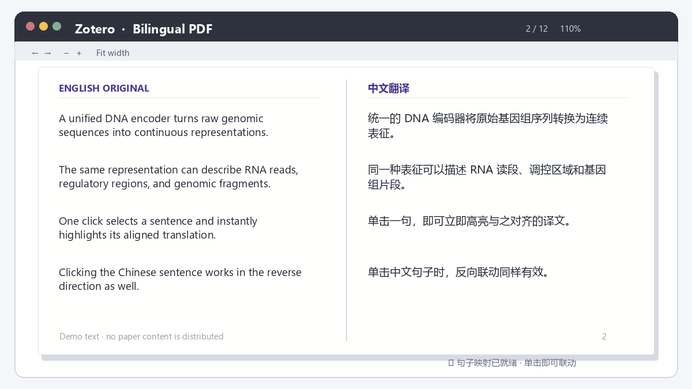
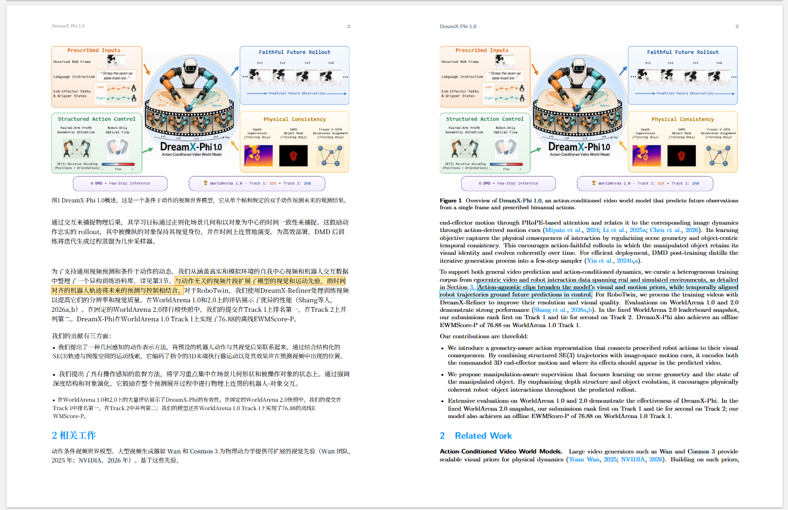
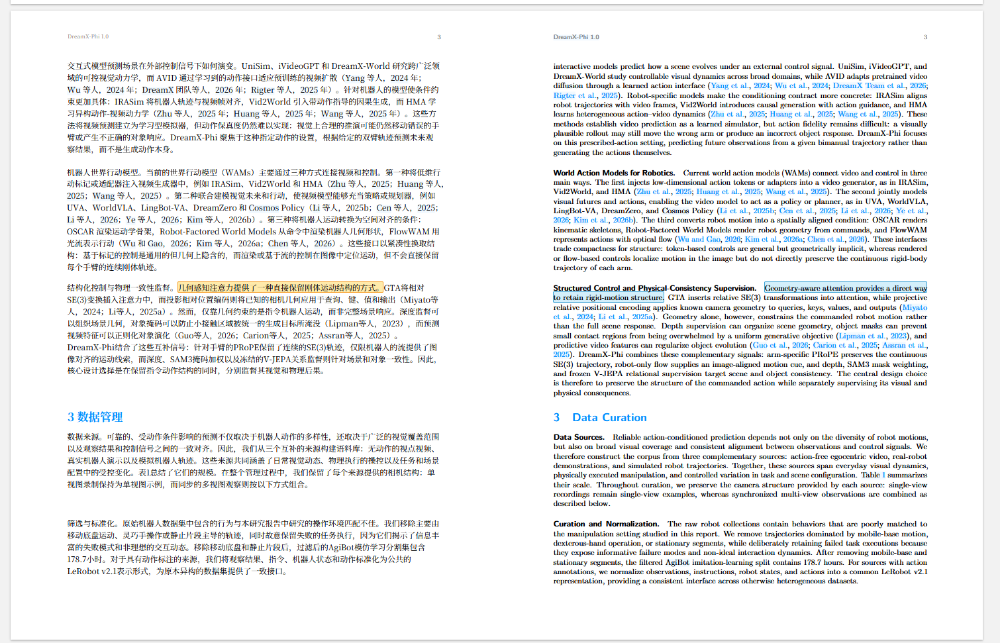
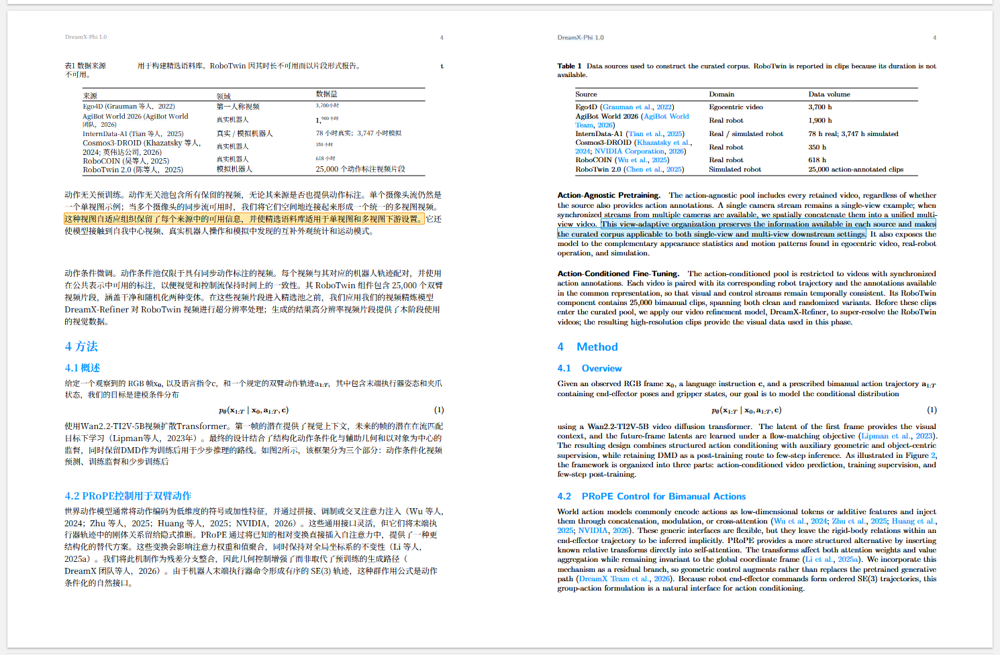
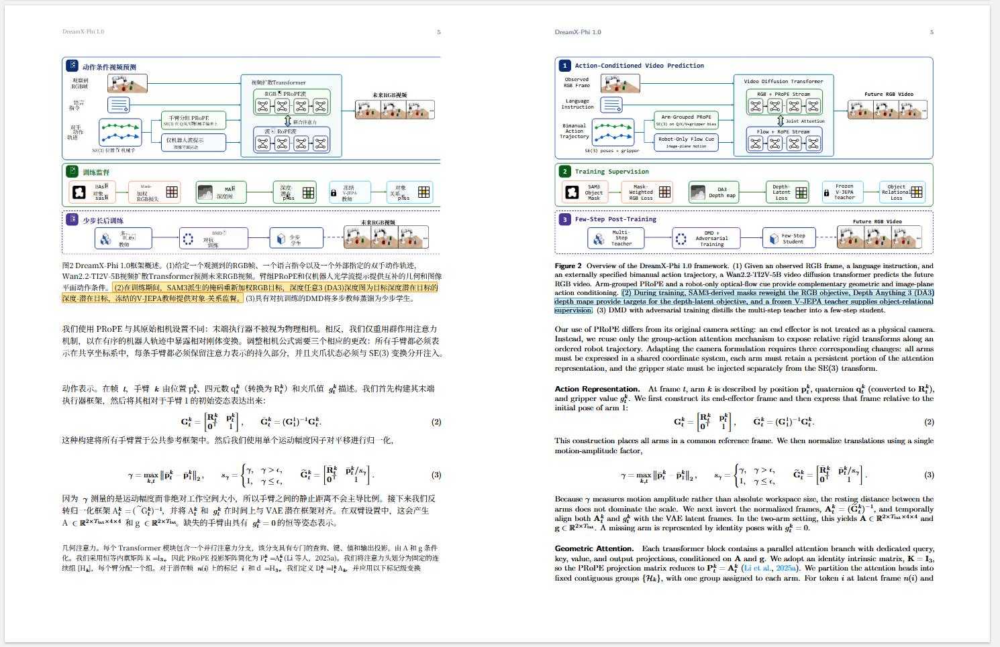

# Zotero Bilingual PDF Reader

<p align="center"><strong>Click a sentence. See its translation.</strong></p>

<p align="center">
  One-click, layout-preserving academic PDF translation for Zotero.<br>
  Click any sentence to highlight its bilingual counterpart—free by default, no API key required.
</p>

<p align="center">
  <a href="README.md">简体中文</a> · <a href="README_EN.md">English</a>
</p>

<p align="center">
  
  
  <a href="https://github.com/Houxin2024/zotero-bilingual-linked-reader/releases/latest"></a>
  
</p>

<p align="center">
  <a href="https://github.com/Houxin2024/zotero-bilingual-linked-reader/releases/download/v0.9.3/bilingual-linked-reader-0.9.3-windows.zip"><strong>⬇️ Download the Windows installer v0.9.3</strong></a>
  · <a href="docs/windows-one-click.md">Setup guide (Chinese)</a>
  · <a href="https://github.com/Houxin2024/zotero-bilingual-linked-reader/issues">Report an issue</a>
</p>

<p align="center">
  
</p>

Right-click an academic PDF in Zotero to create a bilingual, side-by-side document that preserves the original page structure. The translated PDF is attached to the original Zotero item automatically. Once sentence mapping is ready, click either language to highlight its counterpart.

## Why use it?

- **Preserves the paper layout:** formulas, figures, tables, headings, and references stay where you expect them.
- **Links sentences both ways:** English to Chinese and Chinese to English, while native selection, copying, and annotation keep working.
- **Works without an API key:** new installations default to **SiliconFlow Free**; you can switch to your own API or a local service.
- **One-click Windows backend:** no administrator access, WSL, Conda, or preinstalled Python required.
- **Repairs common caption collisions:** overlapping Figure/Table captions are detected and safely reflowed before sentence mapping.

## Get started in four steps

1. [Download the Windows package](https://github.com/Houxin2024/zotero-bilingual-linked-reader/releases/download/v0.9.3/bilingual-linked-reader-0.9.3-windows.zip) and extract the ZIP completely.
2. Double-click `Install-Windows.cmd` and wait for the green completion message.
3. In Zotero, open `Tools → Add-ons → gear icon → Install Add-on From File...`, install both XPI files from the automatically opened `addons` folder, then restart Zotero.
4. Right-click a paper and choose `PDF2zh → Translate`.

> [!TIP]
> New installations use **SiliconFlow Free** by default, with no account or API key required. It is an online third-party service and may be rate-limited. Use your own API or a local service for sensitive papers.

The first setup downloads a private Python runtime, PDF2zh Next, and the local sentence-alignment model. Allow a few minutes and 2–3 GB of disk space. After setup, the backend starts automatically at Windows sign-in.

## Daily workflow

1. Select a paper or PDF attachment in Zotero.
2. Choose `PDF2zh → Translate` from the context menu.
3. The bilingual PDF is attached and opened automatically; mapping progress appears in the lower-right corner.
4. When mapping is ready, click any sentence to read its match.

## Real paper layouts

<p align="center">
  
</p>

<details>
<summary><strong>More real pages: figures, body text, tables, and equations</strong></summary>

<p align="center"></p>
<p align="center"></p>
<p align="center"></p>
<p align="center"></p>

</details>

<p align="center"><sub>Paper pages are shown only to demonstrate layout preservation. Copyright remains with their respective authors.</sub></p>

## Privacy

PDF parsing, coordinate extraction, caption repair, and sentence alignment run locally. The Windows service listens only on `127.0.0.1`; this project's author does not receive your papers, translations, or API keys.

Text to be translated is sent to the provider you select. The default SiliconFlow Free service is online and third-party. For unpublished or confidential papers, use a provider you trust or a local translation service.

## FAQ

<details>
<summary><strong>Can I use it without configuring a provider or API key?</strong></summary>

Yes. A new installation defaults to PDF2zh Next with `SiliconFlow Free`, translating English into Simplified Chinese without an API key. If it is temporarily rate-limited, switch providers in the PDF2zh settings.

</details>

<details>
<summary><strong>Why are there two XPI files?</strong></summary>

`Zotero PDF2zh` translates the full paper and attaches the bilingual PDF. `Zotero Bilingual PDF Reader` adds sentence mapping, progress, and linked highlighting. Zotero requires users to confirm extension installation.

</details>

<details>
<summary><strong>Why is highlighting not ready immediately after translation?</strong></summary>

The PDF returns to Zotero first; the local backend then builds its sentence map. Progress appears in the reader and linked highlighting activates automatically when mapping finishes.

</details>

<details>
<summary><strong>Do I need to start the backend every time?</strong></summary>

No. The Windows package enables startup at sign-in by default. If you stopped it manually, use the “Zotero 双语阅读器 - 启动” desktop shortcut.

</details>

<details>
<summary><strong>Does it support macOS or Linux?</strong></summary>

The one-click package currently targets Windows 10/11 x64. macOS and Linux users can deploy PDF2zh Server and the watcher manually; cross-platform packaging contributions are welcome.

</details>

## Developer and advanced use

Regular Windows users do not need these instructions.

- [Windows setup and troubleshooting (Chinese)](docs/windows-one-click.md)
- [PDF2zh Server and sentence-map watcher integration](docs/pdf2zh-integration.md)
- [Download only the Zotero Bilingual PDF Reader v0.9.3 XPI](https://github.com/Houxin2024/zotero-bilingual-linked-reader/releases/download/v0.9.3/bilingual-linked-reader-0.9.3.xpi)

```bash
# Build the XPI
python scripts/build_xpi.py

# Build the complete Windows package
python scripts/build_windows_bundle.py
```

## Upstream projects and licenses

Full-document translation and layout preservation are powered by [Zotero PDF2zh](https://github.com/guaguastandup/zotero-pdf2zh), [PDFMathTranslate-next](https://github.com/PDFMathTranslate-next/PDFMathTranslate-next), and [BabelDOC](https://github.com/funstory-ai/BabelDOC). This project adds the one-click Windows backend, automatic sentence alignment, linked highlighting, and caption-collision repair.

This repository's own code is MIT-licensed. Bundled or installed upstream components retain their AGPL, Apache-2.0, or dual commercial licenses. See [`windows/THIRD_PARTY_NOTICES.md`](windows/THIRD_PARTY_NOTICES.md).

---

If this improves your paper-reading workflow, please give it a **Star** and share it with other Zotero users.
